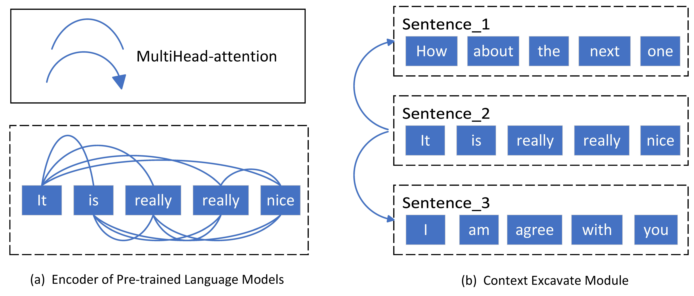

# GCAA
This is a project about Global Context Attention Architecture (GCAA)

# Introduction
GCAA is a framework with global focus， which is made up of three parts. The core component is Context Excavate Module(CEM), which is a Transformer-style encoder block. It is developed to capture long-range sentiment dependencies in consecutive utterances for simulating the continuous expression. Short-rang Features Integration Strategy(SFIS) is designed to enhance the context sensitivity of each micro-feature. Modal Weight Update Strategy(MWUS) is applied for dynamically adjusting the heterogeneous modal weights during modal fusion process.

